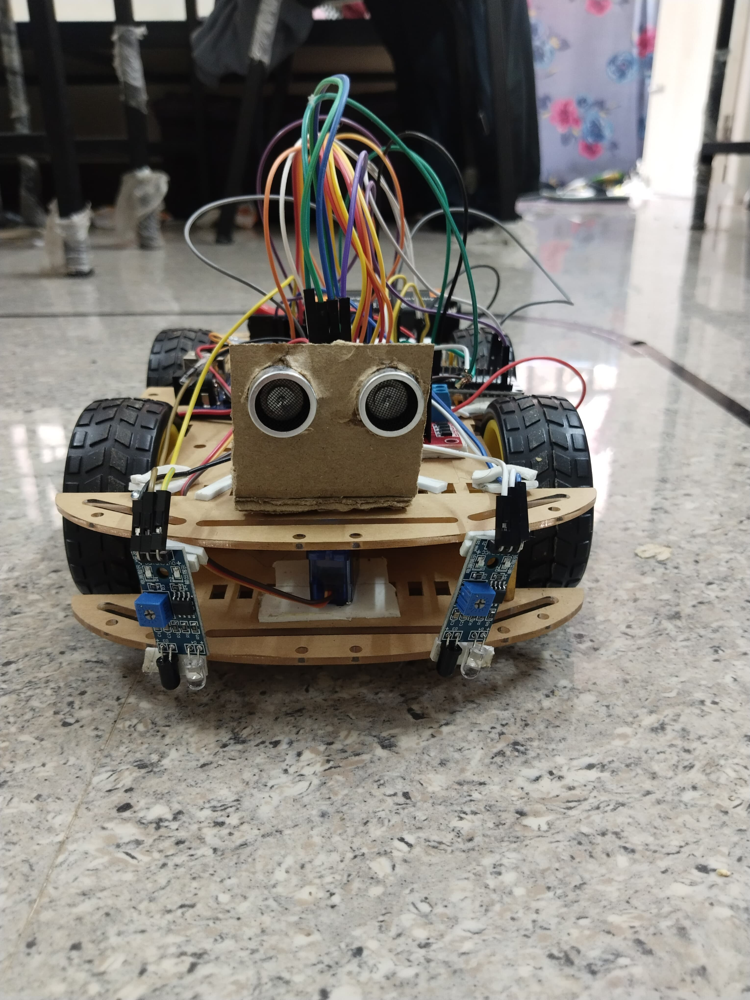
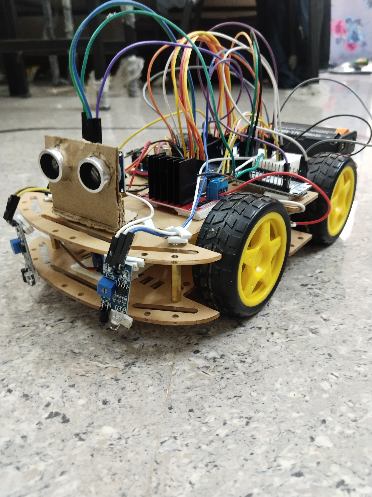
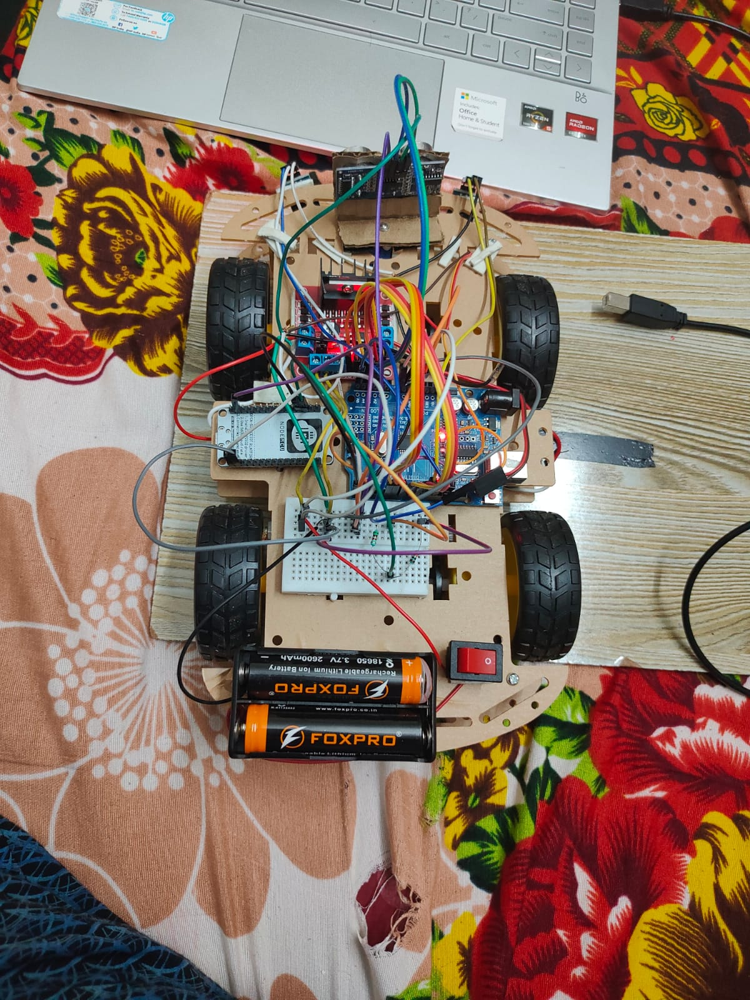

# WiFi-Controlled-Robot-with-Autonomous-and-Manual-Web-Interface-ESP8266-Arduino-
This project allows a robot car to operate in two modes — Autonomous Mode (for obstacle avoidance) and Web Control Mode (for manual control via browser) — using ESP8266 (NodeMCU) and Arduino Uno.

## 📸 Demo Screenshots

### 🖼️ App Preview

